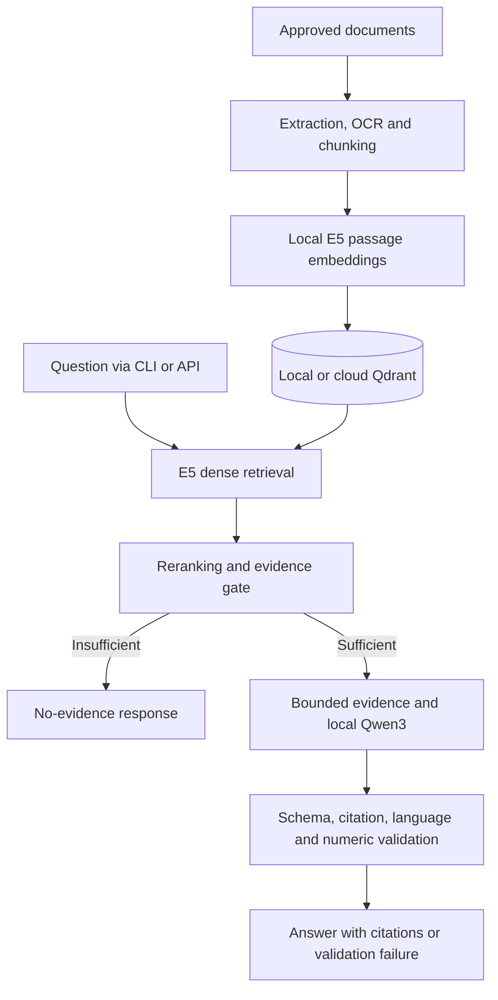

# AI Legal RAG

Arabic/English legal-document retrieval and citation-grounded answering, with
local model inference through Ollama and either local or cloud Qdrant storage.
The project includes document ingestion, embeddings, retrieval, reranking,
evidence checks, structured generation, a CLI, and a FastAPI integration layer.

**Documentation scope:** baseline application code at `09c74a6`, plus the
optional payload-compaction change developed on `feature/compact-qdrant-payload`.
Compaction has been tested through host CLI and API ingestion in isolated cloud
collections; this document does not imply that the branch is merged or deployed. This is a development implementation, not a claim of verified
legal accuracy or production readiness. See the [current project reference](docs/current-project.md)
for the implementation details and known gaps.

## Documentation

| Read this | For |
|---|---|
| [Current project reference](docs/current-project.md) | Architecture, data contracts, component behavior, decisions and limitations |
| [Configuration reference](docs/configuration.md) | Every `Settings` field, effective thresholds and CLI/API differences |
| [Operations and API guide](docs/operations.md) | Setup, deployment, API examples, snapshots and troubleshooting |
| [Evaluation and verification](docs/evaluation.md) | Test suites, historical evidence, reproducible evaluation and release gates |
| [Module reference](docs/module-reference.md) | Source-linked classes, functions and methods across the application |
| [Ingestion architecture](docs/ingestion.md) | Detailed extraction and chunking design |
| [Documentation history](documentation/README.md) | Relationship to the earlier v1/v2 Word handoffs |

## Current capabilities

- **Ingestion:** PDF, DOCX and UTF-8 TXT; native extraction, conditional PDF OCR,
  automatic language classification, legal structure detection and deterministic
  token-aware chunking with source metadata.
- **Embeddings:** local `intfloat/multilingual-e5-base`; normalized 768-dimensional
  vectors; `passage: ` for documents and `query: ` for questions.
- **Storage:** Qdrant cosine search, deterministic UUID point IDs, complete or optionally compact chunk
  payloads, API-key connections, metadata indexes and batched upserts.
- **Retrieval:** dense candidates followed by cross-encoder reranking with
  article, law-name and lexical adjustments. This is **not yet dense+sparse
  hybrid retrieval**: there is no independent BM25/sparse candidate search or
  rank-fusion stage.
- **Answering:** evidence-sufficiency gate, query-aware evidence selection,
  bounded untrusted evidence, Qwen3 structured output, citation-ID validation,
  language checks and numeric/legal-threshold checks.
- **Interfaces:** `legal-rag-ingest`, `legal-rag-query`, `legal-rag-health`,
  `POST /legalAi/Ask`, `POST /legalAi/AddNewOpinion`, and `GET /health`.
- **Deployment/tools:** Docker Compose, source-file inventory/lookup utilities,
  and Qdrant snapshot export/restore utility.

## Architecture



## Quick start: Windows PowerShell

Requires **Python 3.11**, Git and Docker Desktop with Compose. Initial installation
and model downloads require network access. A separate host Ollama installation
is unnecessary when using the Compose Ollama service.

From the repository root:

```powershell
py -3.11 -m venv .venv
.\.venv\Scripts\Activate.ps1
python -m pip install --upgrade pip
python -m pip install -e ".[dev]"
# Add OCR support when ingesting scanned PDFs:
python -m pip install -e ".[ocr,dev]"
```

Use the declared dependency versions in [pyproject.toml](pyproject.toml); do not
independently upgrade the model stack as part of a routine repository update.
Several direct dependencies are pinned, but this is not a complete transitive
dependency lock: installations can still resolve different indirect packages.

Create `.env` if absent, then explicitly select the local backend. The current
`.env.example` activates a cloud connection, so do not copy it and assume local operation.
These environment assignments apply to this PowerShell session:

```powershell
if (!(Test-Path .env)) { Copy-Item .env.example .env }
$env:LEGAL_RAG_QDRANT_URL = "http://localhost:6333"
$env:LEGAL_RAG_QDRANT_API_KEY = ""
$env:LEGAL_RAG_QDRANT_COLLECTION = "legal_chunks"
$env:LEGAL_RAG_OLLAMA_URL = "http://localhost:11434"
$env:LEGAL_RAG_GENERATION_MODEL = "qwen3:4b"
$env:PYTHONUTF8 = "1"

# Start dependencies for the host CLI or host API:
docker compose up -d qdrant ollama
docker compose exec ollama ollama pull qwen3:4b
legal-rag-health
```

For persistent local operation, edit the corresponding values in `.env` too.
Never commit credentials or runtime documents. See [configuration](docs/configuration.md)
for cloud setup and the difference between host and container settings.

### Ingest and query

Use approved files or clearly labelled synthetic demonstration material:

```powershell
legal-rag-ingest ".\data\input\synthetic-demo.txt" --language ar --document-type synthetic --source synthetic-demo
legal-rag-query "ما الأحكام الواردة في المستند؟" --language ar --top-k 20 --top-n 6 --source synthetic-demo
```

Ingestion automatically indexes that document's chunks. The first ingestion
creates the collection; service health alone does not establish that a searchable
collection exists. A refusal is an expected result when evidence is insufficient.

The source filter must match ingestion metadata exactly. `--language ar` controls
answer language; it does not restrict retrieved documents to Arabic.

### Run the API

From the repository root, with the environment above:

```powershell
python -m uvicorn legal_rag_api.main:app --host 127.0.0.1 --port 8001
```

Open [Swagger UI](http://localhost:8001/docs). Port 8001 avoids colliding with
the Compose API on port 8000. Leave this terminal running; Ctrl+C stops the API.

For the full containerized application, when a build is actually needed:

```powershell
docker compose up -d --build
docker compose ps
docker compose logs --tail 50 ai-legal-rag-api ollama-pull
```

Do not run the host API and container API on the same port simultaneously.
The Compose API explicitly uses local Qdrant and Ollama service addresses;
changing the host `.env` does not automatically switch that container to cloud.
`GET /health` is an API liveness check, not a dependency or model-readiness check.

## Optional Qdrant payload compaction

Enable in the environment of the process performing ingestion:

```dotenv
LEGAL_RAG_QDRANT_OMIT_NORMALIZED_TEXT=true
```

The default is **false**. Both CLI ingestion and API `AddNewOpinion` pass this
setting to the vector store. Restart an API process after changing its settings.
For a containerized API, configure the variable in that service and deploy an
image containing the change; editing the host environment is insufficient.

| Data or behavior | With compaction enabled |
|---|---|
| Embedding input | Still uses `normalized_text` |
| `.sources.jsonl`, `.chunks.jsonl`, `.ingestion.json` | Existing formats retained |
| Qdrant `original_text` | Preserved |
| Qdrant `normalized_text` | Omitted only when original text is nonblank |
| Empty/whitespace-only original text | Normalized fallback retained |
| Other payload metadata | Preserved, including identifiers, source and page fields |
| Existing points | No automatic migration; subsequent upserts use the selected mode |

`original_text` means extracted chunk text, not a preserved original document;
it may contain extraction or OCR errors. Retrieval already prefers this field.

Why retain the ingestion files? Cached ingestion reuse depends on the report and
output files, and the chunk reader expects the full JSONL schema. A cached
`duplicate` result reuses extraction artifacts; indexing can still run afterward.
Reusing a document with different metadata may be rejected. Keep metadata stable
when comparing collections rather than bypassing that guard.

Why retain text in Qdrant? API uploads are processed in a temporary directory
which is removed after indexing. Storing only that temporary path would make text
unavailable afterward. The optional `ChunkTextStore` fallback is not a substitute
for durable document storage and is not enabled in the standard pipeline builder.

### Validation performed

Experiments used synthetic material in separate collections, leaving the main
`legal_chunks` collection untouched:

- `legal_chunks_payload_experiment_v1`: seven CLI-indexed chunks; stored payloads
  differed from JSONL only by omitted normalized text; filtered retrieval returned
  text without a file-store fallback.
- `legal_chunks_payload_api_experiment_v1`: seven API-indexed chunks; original text
  remained readable after the upload request completed.
- Eight focused tests passed across `test_qdrant.py`, `test_embeddings_reader.py`
  and `test_query_retriever.py`. Payload tests cover opt-in/default behavior,
  fallback retention, metadata preservation and repeated upserts.

| Synthetic sample measurement | Bytes |
|---|---:|
| Full payload JSON | 11,064 |
| Compact payload JSON | 8,305 |
| Saved | 2,759 (24.9%) |

This is serialized JSON size for one seven-chunk document, **not a measured
reduction in total Qdrant disk/RAM consumption** or proof of unchanged answer
quality across the corpus. No existing collection migration was performed.
Disabling the flag affects future upserts; it does not restore fields to existing
compact points automatically.

## API request and response

`POST /legalAi/Ask` accepts only a question:

```json
{"query": "Your legal question"}
```

It returns `question`, `answer`, `selected_legal_evidence` and `citations`.
The public response currently omits internal retrieval scores and rejection
reasons. `POST /legalAi/AddNewOpinion` accepts multipart form field `file` and
returns a string; verify the response and indexed points, not HTTP status alone.

For Arabic requests on Windows, this Python example avoids PowerShell HTTP
response-decoding problems. Run from the repository in a second activated terminal
while the host API is running:

```powershell
$env:PYTHONUTF8 = "1"
$env:RAG_TEST_QUERY = 'ما الأحكام الواردة في المستند؟'
@'
import json
import os
import httpx

query = os.environ["RAG_TEST_QUERY"]
response = httpx.post(
    "http://127.0.0.1:8001/legalAi/Ask",
    json={"query": query},
    timeout=600,
)
response.raise_for_status()
result = json.loads(response.content.decode("utf-8"))
print("Question preserved:", result.get("question") == query)
print(json.dumps(result, ensure_ascii=False, indent=2))
'@ | python -
```

Do not label an unfiltered cloud question as supported solely because it worked
against a synthetic-only collection. Inspect source applicability and evidence.
Synthetic fixtures and documents labelled as drafts must not be silently treated
as verified legal authority.

## Routine restart and deployment boundaries

For an existing installation, activate the existing environment; do not recreate
it or reinstall dependencies on every restart. With Docker Desktop running:

```powershell
.\.venv\Scripts\Activate.ps1
# Existing containers only; this does not rebuild images or pull models:
docker compose start ollama
# Also start local Qdrant if your host configuration uses it:
docker compose start qdrant
legal-rag-health
```

Host CLI/API settings and Compose API settings can point to different databases,
even if both collections are named `legal_chunks`. Verify the endpoint and
collection before ingestion. Never print the complete Settings object when it
contains credentials.

The Dockerfile installs OCR dependencies and pre-downloads embedding, reranking
and OCR models. Builds can be large; dependency installation may include GPU
libraries even when application devices are configured as CPU. CPU runtime
settings alone do not select CPU-only dependency packages. Avoid rebuilding to
test source-only changes when the existing host environment is available.

A successful Git pull or commit does not update an existing container's installed
Python package. API liveness also does not establish that the newest code is
running. Do not delete database/model volumes to resolve an image-build failure.

## Important current limitations

- The shared CLI/API builder currently hard-codes dense `0.855`, identifier
  override `0.75`, and rerank `4.0`. Their corresponding experimental `.env`
  fields are parsed but do not determine these effective thresholds.
- `/Ask` accepts only `query`, uses language `mixed`, and has no request-level
  source filter. CLI and API share the core but are not identical experiments.
- Citation validity and numeric checks do not prove that every claim is supported.
  Exact article matches do not guarantee the correct law, version or jurisdiction.
- There is no application authentication/RBAC, approved-opinion workflow,
  document deletion/replacement command, versioned collection alias, or integrated
  Phoenix/Grafana instrumentation in this checkpoint.
- Cloud Qdrant receives vectors **and chunk text/metadata**. It is not a metadata-only
  or entirely on-premise deployment.
- Full quality checks must be rerun on this checkpoint. Earlier 92/97/101-test
  results and the separate `unit_tests` 251-test claim are historical, not current badges.

## Testing

The default suite is `tests/`:

```powershell
python -m pytest -q --cov=legal_rag --cov-report=term-missing
python -m ruff check src tests
python -m ruff format --check src tests
python -m mypy src tests
python -m pip check
git diff --check
```

The configured coverage requirement is 80%. The additional `unit_tests/` suite
uses lightweight model stubs and has its own configuration; see the
[evaluation guide](docs/evaluation.md) for the correct invocation and limitations.
The opt-in integration test also requires a particular local processed fixture;
setting its environment flag alone is not sufficient.

## Data and contribution workflow

Keep input documents, extracted text, Qdrant snapshots, model caches, logs and
credentials outside tracked changes. Cloud endpoints and private source names
must also be removed from public reports and screenshots. A `.gitignore` is not
an access-control policy and does not cover every possible archive extension.

Work on a focused branch, review `git diff`, run the relevant checks and push the
branch before opening a pull request. A local commit alone does not appear on
GitHub. Document behavior changes and record the tested code revision, corpus,
model and configuration alongside evaluation results.
