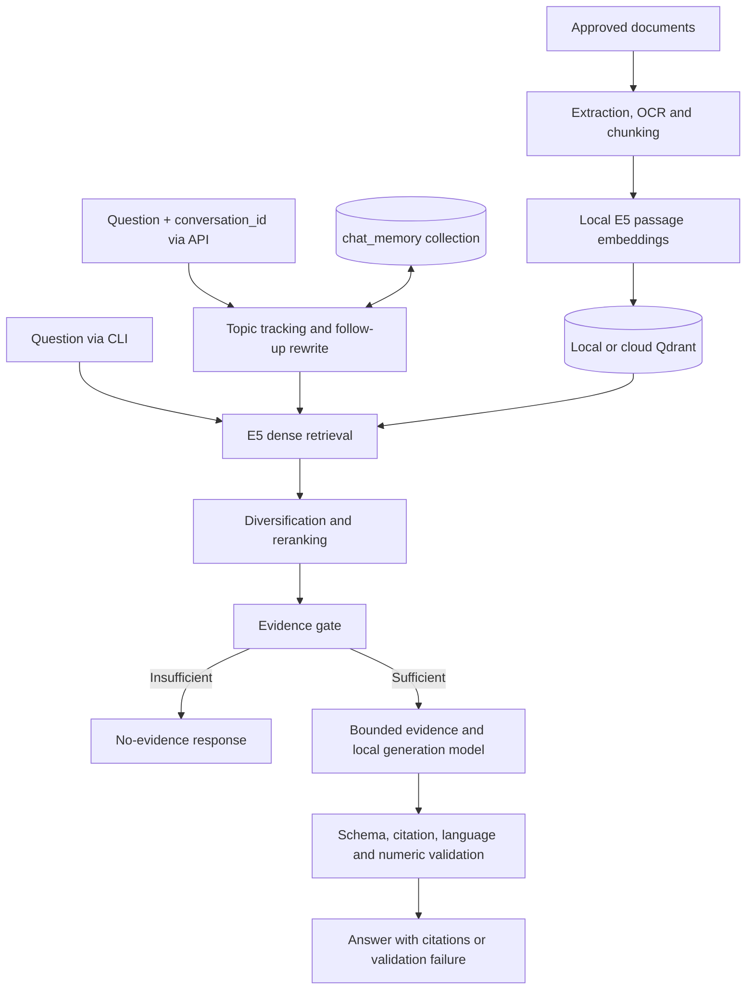

# AI Legal RAG

Arabic/English legal-document retrieval and citation-grounded answering, with
local model inference through Ollama and either local or cloud Qdrant storage.
The project includes document ingestion, embeddings, retrieval, reranking,
evidence checks, structured generation, conversation memory for follow-up
questions, a CLI, and a FastAPI integration layer.

**Documentation scope:** This README describes the code on `main` at `9f0cdfb`
(merge of PR #17). It covers the baseline pipeline, optional Qdrant payload
compaction, conversation memory with query contextualization, optional Phoenix
tracing, and the BM25 keyword-search and rank-fusion building blocks. This is a
development implementation, not a claim of verified legal accuracy or production
readiness. Some linked documents describe earlier checkpoints; where they
disagree with this README, the code is the source of truth.

## Documentation

| Read this | For |
|---|---|
| [Ingestion architecture](docs/ingestion.md) | Code tour of extraction, normalization, structure detection and chunking |
| [Payload compaction note](docs/payload-compaction.md) | Short note on the optional compact Qdrant payload (see the compaction section below for current behavior) |
| [Phoenix plan](docs/observability/phoenix-plan.md) and [runbook](docs/observability/phoenix-runbook.md) | Optional tracing: scope, Windows setup and verification |
| [Day 2.1 closeout](docs/day2-1-closeout.md) | Historical record of the ingestion contract |
| [Unit test suite](unit_tests/README.md) | The separate stub-based suite (its counts are historical) |
| [Earlier Word handoffs](documentation/) | v1 and v2 documents; superseded by the code and this README |

## Current capabilities

- **Ingestion:** PDF, DOCX and UTF-8 TXT; native extraction, conditional PDF OCR,
  automatic language classification, legal structure detection and deterministic
  token-aware chunking with source metadata.
- **Embeddings:** local `intfloat/multilingual-e5-base`; normalized 768-dimensional
  vectors; `passage: ` for documents and `query: ` for questions.
- **Storage:** Qdrant cosine search, deterministic UUID point IDs, complete or
  optionally compact chunk payloads, API-key connections, metadata indexes and
  batched upserts.
- **Conversation memory (API only):** conversations, messages and the current
  topic are stored in a separate Qdrant collection named `chat_memory`. For each
  question, a small local model (`qwen2.5:3b` by default) tracks the topic and
  rewrites follow-up questions into standalone queries before retrieval.
- **Retrieval:** dense E5 candidates, then diversification (at most four chunks
  per document), then cross-encoder reranking with article, law-name and lexical
  adjustments, then a procedure-mismatch guard. A BM25 keyword retriever and
  reciprocal rank fusion exist in the code, but the standard CLI/API pipeline
  does **not** use them (see the retrieval note below).
- **Answering:** evidence-sufficiency gate, query-aware evidence selection,
  bounded untrusted evidence, structured output from the configured Ollama model,
  citation-ID validation, language checks and numeric/legal-threshold checks.
- **Interfaces:** `legal-rag-ingest`, `legal-rag-query`, `legal-rag-health`, and
  the API endpoints listed under "API request and response" below.
- **Observability (optional):** metadata-only OpenTelemetry tracing to a separate
  Phoenix service. Disabled by default.
- **Deployment/tools:** Docker Compose, source-file inventory/lookup utilities,
  and a Qdrant snapshot export/restore utility.

### Retrieval note: keyword search is not active yet

`bm25_index.py`, `keyword_retriever.py` and `hybrid_fusion.py` implement an
in-memory BM25 index (built from `*.chunks.jsonl` files) and reciprocal rank
fusion. `RAGAnswerPipeline` accepts an optional keyword retriever and fuses it
with dense results before reranking. However, `_build_pipeline` in
`query/cli.py`, which both the CLI and the API use, never passes one in, so the
running system is **dense retrieval plus reranking only**. The evidence gate
always reads dense scores, never fused scores. To compare the two retrievers on
one question without changing the pipeline:

```powershell
python -m legal_rag.query.compare_retrieval_cli "your question" --top-k 15 --processed-dir data/processed
```

## Architecture


```mermaid
flowchart TD
    D["Approved documents"] --> I["Extraction, OCR and chunking"]
    I --> E["Local E5 passage embeddings"]
    E --> V[("Local or cloud Qdrant")]
    Q["Question via CLI"] --> R
    A["Question + conversation_id via API"] --> T["Topic tracking and follow-up rewrite"]
    M[("chat_memory collection")] <--> T
    T --> R["E5 dense retrieval"]
    V --> R
    R --> X["Diversification and reranking"]
    X --> K["Evidence gate"]
    K -->|Insufficient| N["No-evidence response"]
    K -->|Sufficient| G["Bounded evidence and local generation model"]
    G --> C["Schema, citation, language and numeric validation"]
    C --> O["Answer with citations or validation failure"]
```

## Quick start: Windows PowerShell

Requires **Python 3.11**, Git and Docker Desktop with Compose. Initial installation
and model downloads require network access. A separate host Ollama installation
is unnecessary when using the Compose Ollama service.

From the repository root:

```powershell
py -3.11 -m venv .venv
.\.venv\Scripts\Activate.ps1
python -m pip install --upgrade pip
python -m pip install -e ".[dev]"
# Add OCR support when ingesting scanned PDFs:
python -m pip install -e ".[ocr,dev]"
# Add tracing support only if you will use Phoenix:
python -m pip install -e ".[phoenix]"
```

Use the declared dependency versions in [pyproject.toml](pyproject.toml); do not
independently upgrade the model stack as part of a routine repository update.
Several direct dependencies are pinned, but this is not a complete transitive
dependency lock: installations can still resolve different indirect packages.

Create `.env` if absent, then explicitly select the local backend. The current
`.env.example` activates a cloud Qdrant connection, so do not copy it and assume
local operation. These environment assignments apply to this PowerShell session:

```powershell
if (!(Test-Path .env)) { Copy-Item .env.example .env }
$env:LEGAL_RAG_QDRANT_URL = "http://localhost:6333"
$env:LEGAL_RAG_QDRANT_API_KEY = ""
$env:LEGAL_RAG_QDRANT_COLLECTION = "legal_chunks"
$env:LEGAL_RAG_OLLAMA_URL = "http://localhost:11434"
$env:LEGAL_RAG_GENERATION_MODEL = "gemma3:4b"
$env:LEGAL_RAG_CONTEXTUALIZATION_MODEL = "qwen2.5:3b"
$env:PYTHONUTF8 = "1"

# Start dependencies for the host CLI or host API:
docker compose up -d qdrant ollama
docker compose exec ollama ollama pull gemma3:4b
docker compose exec ollama ollama pull qwen2.5:3b
legal-rag-health
```

Two models are needed: the answer-generation model and the smaller
contextualization model used only by the API chat flow. The code default for the
generation model is `qwen3:4b`; `.env.example` and the Compose file select
`gemma3:4b`. Whatever you choose must be pulled into Ollama first.
`legal-rag-health` checks Qdrant and the **generation** model only; it does not
check that the contextualization model is installed.

For persistent local operation, edit the corresponding values in `.env` too.
Never commit credentials or runtime documents. Host settings and Compose
settings are separate; see "Docker Compose" below.

### Key settings

All settings use the `LEGAL_RAG_` prefix and can be set in `.env`.

| Setting | Code default | Notes |
|---|---|---|
| `GENERATION_MODEL` | `qwen3:4b` | `.env.example` and Compose use `gemma3:4b` |
| `CONTEXTUALIZATION_MODEL` | `qwen2.5:3b` | Topic tracking and follow-up rewrite (API only) |
| `CONTEXTUALIZATION_TIMEOUT_SECONDS` | `60` | |
| `RETRIEVAL_TOP_K` / `RERANK_TOP_N` / `EVIDENCE_TOP_N` | `20` / `6` / `2` | Must satisfy evidence ≤ rerank ≤ retrieval |
| `EVIDENCE_MINIMUM_DENSE_SCORE` | `0.855` | Used by the evidence gate |
| `EVIDENCE_IDENTIFIER_OVERRIDE_SCORE` | `0.75` | Used by the evidence gate |
| `EVIDENCE_MINIMUM_RERANK_SCORE` | `0.5` | Used by the evidence gate |
| `EXPERIMENTAL_MAX_DENSE_SCORE_DROP` | `0.02` | Used during evidence selection |
| `QDRANT_OMIT_NORMALIZED_TEXT` | `false` | Payload compaction; CLI ingestion only |
| `PHOENIX_ENABLED` | `false` | Tracing; separate `LEGAL_RAG_PHOENIX_*` group |

The older `EXPERIMENTAL_MIN_DENSE_SCORE`, `EXPERIMENTAL_IDENTIFIER_OVERRIDE_SCORE`
and `EXPERIMENTAL_MIN_RERANK_SCORE` values in `.env.example` are still parsed and
validated, but they do not set the thresholds the pipeline uses. Change the
`EVIDENCE_*` settings above instead. These are experimental values that have not
been calibrated across a corpus.

### Ingest and query

Use approved files or clearly labelled synthetic demonstration material:

```powershell
legal-rag-ingest ".\data\input\synthetic-demo.txt" --language ar --document-type synthetic --source synthetic-demo
legal-rag-query "ما الأحكام الواردة في المستند؟" --language ar --top-k 20 --top-n 6 --source synthetic-demo
```

Ingestion automatically indexes that document's chunks. The first ingestion
creates the collection; service health alone does not establish that a searchable
collection exists. A refusal is an expected result when evidence is insufficient.

The CLI is single-shot: it has no conversation memory. The source filter must
match ingestion metadata exactly. `--language ar` controls answer language; it
does not restrict retrieved documents to Arabic.

### Run the API

From the repository root, with the environment above:

```powershell
python -m uvicorn legal_rag_api.main:app --host 127.0.0.1 --port 8001
```

Open [Swagger UI](http://localhost:8001/docs). Port 8001 avoids colliding with
the Compose API on port 8000. Leave this terminal running; Ctrl+C stops the API.
Do not run the host API and container API on the same port simultaneously.
`GET /health` is an API liveness check, not a dependency or model-readiness check.

## Docker Compose

`docker-compose.yml` defines the API, local Qdrant, Ollama and a one-shot
`ollama-pull` helper. Points to know before using it:

- The API service uses a **prebuilt image** (`yahiakhattab/ai-legal-rag-api:2.0`)
  and the file has no `build:` section, so `docker compose up --build` does not
  rebuild it from your working copy. To run local source in a container, build
  from the [Dockerfile](Dockerfile) and point `image:` at the result.
- The Compose API is configured for a **cloud Qdrant cluster**, not the local
  `qdrant` service, and it has Phoenix tracing switched on toward
  `host.docker.internal:6006`. Changing the host `.env` does not change the
  container's settings.
- Credentials must not live in this file. Put the Qdrant URL and key in an
  untracked `.env` or secret store and reference them from Compose.
- `ollama-pull` fetches only `qwen3:4b`. The Compose API asks for `gemma3:4b`,
  and the chat flow also needs `qwen2.5:3b`. Pull both into the Ollama volume
  (`docker compose exec ollama ollama pull gemma3:4b`, then the same for
  `qwen2.5:3b`) or update the helper.

```powershell
docker compose up -d
docker compose ps
docker compose logs --tail 50 ai-legal-rag-api ollama-pull
```

The Dockerfile installs the OCR and Phoenix extras and pre-downloads the
embedding and reranking models. OCR model pre-download is currently commented
out, so test `/legalAi/AddNewOpinion` with a real scanned PDF before relying on
OCR in a container. Builds can be large; dependency installation may include GPU
libraries even when application devices are configured as CPU. A successful Git
pull or commit does not update an existing container's installed Python package,
and API liveness does not establish that the newest code is running. Do not
delete database/model volumes to resolve an image-build failure.

## Optional Qdrant payload compaction

Enable in the environment of the process performing ingestion:

```dotenv
LEGAL_RAG_QDRANT_OMIT_NORMALIZED_TEXT=true
```

The default is **false**. At this revision only **CLI ingestion** (`legal-rag-ingest`)
passes this setting to the vector store. `POST /legalAi/AddNewOpinion` builds its
vector store without it, so API uploads always store the full payload, and the
older [payload compaction note](docs/payload-compaction.md) listing the API as
supported is out of date. Restart a process after changing its settings.

| Data or behavior | With compaction enabled (CLI ingestion) |
|---|---|
| Embedding input | Still uses `normalized_text` |
| `.sources.jsonl`, `.chunks.jsonl`, `.ingestion.json` | Existing formats retained |
| Qdrant `original_text` | Preserved |
| Qdrant `normalized_text` | Omitted only when original text is nonblank |
| Empty/whitespace-only original text | Normalized fallback retained |
| Other payload metadata | Preserved, including identifiers, source and page fields |
| Existing points | No automatic migration; subsequent upserts use the selected mode |

`original_text` means extracted chunk text, not a preserved original document;
it may contain extraction or OCR errors. Retrieval already prefers this field.

Why retain the ingestion files? Cached ingestion reuse depends on the report and
output files, and the chunk reader expects the full JSONL schema. A cached
`duplicate` result reuses extraction artifacts; indexing can still run afterward.
Reusing a document with different metadata may be rejected. Keep metadata stable
when comparing collections rather than bypassing that guard.

Why retain text in Qdrant? API uploads are processed in a temporary directory
which is removed after indexing. Storing only that temporary path would make text
unavailable afterward. The optional `ChunkTextStore` fallback is not a substitute
for durable document storage and is not enabled in the standard pipeline builder.

### Validation performed

Experiments (run before the API stopped passing the flag) used synthetic material
in separate collections, leaving the main `legal_chunks` collection untouched:

- `legal_chunks_payload_experiment_v1`: seven CLI-indexed chunks; stored payloads
  differed from JSONL only by omitted normalized text; filtered retrieval returned
  text without a file-store fallback.
- `legal_chunks_payload_api_experiment_v1`: seven API-indexed chunks; original text
  remained readable after the upload request completed. This result applies to the
  earlier API code and has not been repeated for the current API.
- Eight focused tests passed across `test_qdrant.py`, `test_embeddings_reader.py`
  and `test_query_retriever.py`.

| Synthetic sample measurement | Bytes |
|---|---:|
| Full payload JSON | 11,064 |
| Compact payload JSON | 8,305 |
| Saved | 2,759 (24.9%) |

This is serialized JSON size for one seven-chunk document, **not a measured
reduction in total Qdrant disk/RAM consumption** or proof of unchanged answer
quality across the corpus. No existing collection migration was performed.
Disabling the flag affects future upserts; it does not restore fields to existing
compact points automatically.

## API request and response

All routes are under `/legalAi` except `GET /health`. There is no authentication.

| Method and path | Purpose |
|---|---|
| `POST /legalAi/Conversation` | Create a conversation (`title`, optional) |
| `GET /legalAi/Conversations` | List up to 50 conversations |
| `GET /legalAi/Conversation/{conversation_id}` | Conversation details and up to 1000 messages |
| `PATCH /legalAi/Conversation/{conversation_id}` | Rename (`title`) |
| `DELETE /legalAi/Conversation/{conversation_id}` | Delete; returns 204 |
| `POST /legalAi/Ask` | Answer a question within a conversation |
| `POST /legalAi/AddNewOpinion` | Upload and index a PDF, DOCX or TXT file |
| `GET /health` | API liveness only |

`POST /legalAi/Ask` requires **both** a question and an existing conversation:

```json
{"query": "Your legal question", "conversation_id": "<uuid from POST /legalAi/Conversation>"}
```

An unknown `conversation_id` returns 404. For each question the API reads up to
the last ten messages and the stored topic, updates the topic, rewrites the
question into a standalone query, runs the pipeline on the rewritten query, and
then saves the original question and the answer to the conversation. The response
contains `conversation_id`, `question` (the original wording), `answer`,
`selected_legal_evidence` and `citations`. It omits internal retrieval scores and
rejection reasons. `Ask` always uses language `mixed` and has no request-level
source filter.

`POST /legalAi/AddNewOpinion` accepts multipart form field `file` (PDF, DOCX or
TXT, within the size limit) and returns JSON like
`{"filename": "...", "indexed_chunks": 7}`. Verify the indexed points, not HTTP
status alone.

For Arabic requests on Windows, this Python example avoids PowerShell HTTP
response-decoding problems. Run from the repository in a second activated terminal
while the host API is running:

```powershell
$env:PYTHONUTF8 = "1"
$env:RAG_TEST_QUERY = 'ما الأحكام الواردة في المستند؟'
@'
import json
import os
import httpx

base = "http://127.0.0.1:8001/legalAi"
query = os.environ["RAG_TEST_QUERY"]

created = httpx.post(f"{base}/Conversation", json={"title": "Smoke test"}, timeout=60)
created.raise_for_status()
conversation_id = created.json()["conversation_id"]

response = httpx.post(
    f"{base}/Ask",
    json={"query": query, "conversation_id": conversation_id},
    timeout=600,
)
response.raise_for_status()
result = json.loads(response.content.decode("utf-8"))
print("Question preserved:", result.get("question") == query)
print(json.dumps(result, ensure_ascii=False, indent=2))
'@ | python -
```

Do not label an unfiltered cloud question as supported solely because it worked
against a synthetic-only collection. Inspect source applicability and evidence.
Synthetic fixtures and documents labelled as drafts must not be silently treated
as verified legal authority.

## Optional Phoenix observability (development increment)

Manual, metadata-only tracing covers the CLI, the API `Ask` flow, chat-memory
operations, query rewriting, pipeline initialization, embedding, dense retrieval,
diversification, reranking, evidence assessment and selection, prompt
construction, structured generation and final result diagnostics. It is disabled
by default and exports no prompts, answers, document text, vectors, keys or file
paths.

```powershell
python -m pip install -e ".[phoenix]"
docker compose -f compose.phoenix.yml up -d    # Phoenix 20.11.0 on http://localhost:6006
$env:LEGAL_RAG_PHOENIX_ENABLED = "true"
$env:LEGAL_RAG_PHOENIX_ENDPOINT = "http://127.0.0.1:6006/v1/traces"
```

The endpoint must end in `/v1/traces` and contain no credentials. Phoenix runs
separately from the RAG API, so no API image rebuild is needed to run it. See the
[plan](docs/observability/phoenix-plan.md) and
[Windows runbook](docs/observability/phoenix-runbook.md). Live Phoenix
verification, the reviewed evaluation dataset and controlled experiments are not
complete. A per-session pseudonym helper (`correlate_session`) exists in the
tracing module, but the `Ask` route does not currently call it, so traces are not
grouped by conversation.

## Routine restart and deployment boundaries

For an existing installation, activate the existing environment; do not recreate
it or reinstall dependencies on every restart. With Docker Desktop running:

```powershell
.\.venv\Scripts\Activate.ps1
# Existing containers only; this does not rebuild images or pull models:
docker compose start ollama
# Also start local Qdrant if your host configuration uses it:
docker compose start qdrant
legal-rag-health
```

Host CLI/API settings and Compose API settings can point to different databases,
even if both collections are named `legal_chunks`. Verify the endpoint and
collection before ingestion. Never print the complete Settings object when it
contains credentials. Avoid rebuilding to test source-only changes when the
existing host environment is available.

## Known issues at this revision

Delete items from this list as they are fixed.

- **Query construction fails.** `query/cli.py` reads `settings.generation_max_tokens`,
  but `Settings` does not define it, so `legal-rag-query` and `POST /legalAi/Ask`
  raise an `AttributeError` when the pipeline is built. Adding
  `generation_max_tokens: int = Field(default=384, ge=1, le=8192)` to `Settings`
  matches the generation client's own default. Until then, ingestion works but
  answering does not.
- **Credentials in a tracked file.** `docker-compose.yml` contains a hard-coded
  Qdrant API key. Rotate it and move it out of the repository.
- **Compose model mismatch.** The `ollama-pull` helper does not pull the models the
  Compose API and chat flow need (see "Docker Compose").

## Important current limitations

- `/Ask` uses language `mixed` and has no request-level source filter. CLI and API
  share the core pipeline but are not identical experiments, and only the API has
  conversation memory.
- Keyword/BM25 retrieval and rank fusion are not part of the running pipeline
  (see the retrieval note above). The BM25 index lives in memory and must be
  rebuilt from `*.chunks.jsonl` files after new ingestion.
- Follow-up rewriting is done by a small model plus Arabic follow-up patterns. A
  wrong topic or rewrite changes what is retrieved, and the response shows only
  the original question, not the rewritten query.
- Citation validity and numeric checks do not prove that every claim is supported.
  Exact article matches do not guarantee the correct law, version or jurisdiction.
  The procedure-mismatch guard targets individual versus collective labor-dispute
  evidence only.
- Conversations are not tied to a user: any caller can list, read, rename or delete
  any conversation. There is no application authentication/RBAC, approved-opinion
  workflow, document deletion/replacement command or versioned collection alias.
- Conversation messages, topics and answers are stored as plain text in the
  `chat_memory` Qdrant collection, and retention is not managed.
- The pipeline and API still print questions, rewritten queries, answers and
  timing details to standard output. Treat container and terminal logs as
  sensitive.
- Cloud Qdrant receives vectors **and chunk text/metadata**, plus chat memory when
  the API uses the same cluster. It is not a metadata-only or entirely on-premise
  deployment.
- Full quality checks must be rerun on this revision. The earlier 92/97/101-test
  results and the `unit_tests` 251-test claim are historical, not current badges,
  and they predate the chat-context, keyword-search and Phoenix changes.

## Testing

The default suite is `tests/`:

```powershell
python -m pytest -q --cov=legal_rag --cov-report=term-missing
python -m ruff check src tests
python -m ruff format --check src tests
python -m mypy src tests
python -m pip check
git diff --check
```

The configured coverage requirement is 80%. There is a `tests/test_observability.py`,
but no dedicated tests yet for `chat_context`, the BM25 index, keyword retriever or
rank fusion, so check the coverage gate on this revision before relying on it.
The additional `unit_tests/` suite uses lightweight model stubs and has its own
configuration; see its [README](unit_tests/README.md). The opt-in integration test
also requires a particular local processed fixture; setting its environment flag
alone is not sufficient.

## Data and contribution workflow

Keep input documents, extracted text, Qdrant snapshots, model caches, logs and
credentials outside tracked changes. Cloud endpoints, API keys and private source
names must also be removed from public reports, screenshots and configuration
files. A `.gitignore` is not an access-control policy and does not cover every
possible archive extension.

Work on a focused branch, review `git diff`, run the relevant checks and push the
branch before opening a pull request. A local commit alone does not appear on
GitHub. Document behavior changes and record the tested code revision, corpus,
model and configuration alongside evaluation results.
