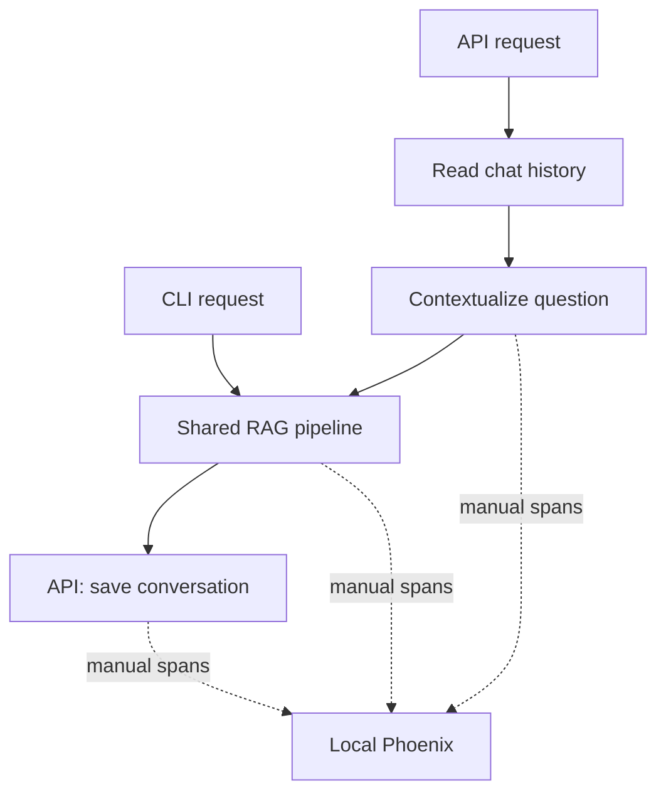

# Phoenix integration plan — revision 3

Reviewed 13 September 2026 against `main` commit `9846654` (chat context merged).
This supersedes revision 2. Repository review is complete; deployment and live evaluation remain to be performed. Historical test counts are not evidence that this revision passes.

## Goal and scope

Use self-hosted Phoenix to explain and improve Arabic/English legal RAG failures through traces, reviewed examples, and controlled experiments. The agreed first milestone remains **tracing + a small reviewed dataset + an experiment comparison**. Installing a dashboard alone does not complete it.

Start with Phoenix and direct OTLP/HTTP export from our custom Python code. Do not add LangChain, LlamaIndex, an OpenTelemetry Collector, Grafana, Loki, Tempo, Prometheus/Mimir or Alloy now. Those are optional later additions justified by an actual operational question. Do not change models, evidence thresholds, retrieval algorithms, public response schemas or existing indexed documents as a side effect of instrumentation.

## What changed since the previous plan

| Area | Verified current implementation | Integration consequence |
| --- | --- | --- |
| Retrieval | E5 dense query against Qdrant; candidate diversification; cross-encoder and lexical/legal ranking rules | Trace dense candidates and reranked ordering separately. Keyword rules are not an independent BM25/sparse retrieval channel or reciprocal rank fusion. |
| Chat | API accepts optional `session_id`, creates one if absent, returns it, reads/writes `chat_memory` in Qdrant | API root must include memory read, rewrite, RAG and memory writes. CLI remains single-turn. |
| Rewrite | `QueryContextualizer` uses recent user questions and `qwen2.5:3b`; first turn bypasses rewrite generation | Distinguish contextualization LLM calls from final-answer LLM calls. History is context, never legal evidence. |
| Answer model | `qwen3:4b`, HTTPX `/api/chat`, `think=False`, optional JSON schema | Instrument this wrapper directly; SDK instrumentation for OpenAI would miss it. Never export thinking. |
| Language | Pipeline detects language when called with `mixed` | Record requested and resolved language; evaluate Arabic follow-ups and topic changes. |
| Payloads | Optional omission of `normalized_text`; original text stays in Qdrant | No reindex or file-store fallback needed for tracing. Preserve full ingestion artifacts. |
| Dependencies | `pyproject.toml` unchanged between the prior inspected main and this main | Install existing declared dependencies only if missing; add a small optional tracing extra. Both Ollama models may be needed for API chats. |

Source anchors: [API flow](https://github.com/YahiaKhattab/ai-legal-rag/blob/9846654/legal_rag_api/routers/legal_ai.py), [builder](https://github.com/YahiaKhattab/ai-legal-rag/blob/9846654/src/legal_rag/query/cli.py), [reranker](https://github.com/YahiaKhattab/ai-legal-rag/blob/9846654/src/legal_rag/query/reranker.py), [memory](https://github.com/YahiaKhattab/ai-legal-rag/blob/9846654/src/legal_rag/chat_context/memory.py), [Ollama](https://github.com/YahiaKhattab/ai-legal-rag/blob/9846654/src/legal_rag/query/ollama_client.py).

### Baseline limitations to preserve and make visible

- The shared builder uses dense `0.855`, identifier override `0.75`, and rerank `4.0`. Several similarly named Settings defaults differ. Record the evaluator's **effective** configuration, not only environment settings. Fixing the wiring is a separate evaluated change.
- Chat memory scrolls one page and sorts that page by time; it does not guarantee the newest ten messages in a longer conversation. Include a conversation exceeding ten stored messages in regression tests.
- Rewriting takes recent user questions, not an authoritative legal history. Topic drift and unsupported assumptions are evaluation targets.
- The API builds pipeline objects per request and performs synchronous model/database work inside an async route. Separate initialization latency from query latency; do not claim throughput improvements from tracing.
- A healthy old Docker API can still contain old code and point at local Qdrant while the host API uses Cloud. Use the latest host API on port 8001 for this work and verify effective settings there.
- Existing application debug prints include raw questions/answers/error bodies. Remove those debug dumps in the instrumentation patch; CLI's intentional answer display remains. Trace privacy does not automatically govern chat-memory storage or every existing log.
- Session IDs are correlation identifiers, not authorization. Do not expose this development API publicly as part of the integration.

## Intended topology

Use one owned tracer provider per CLI process/API worker. Send directly to `http://127.0.0.1:6006/v1/traces`. The Phoenix container needs only loopback port 6006 and a persistent volume. It must not depend on or rebuild the API image. The application must continue working when tracing is disabled or Phoenix is unavailable.

## Trace contract

| Span | Safe metadata | Later opt-in synthetic content |
| --- | --- | --- |
| `api.ask` / `cli.query` | entry point, completion/error type; pseudonymous session correlation | reviewed demonstration question |
| `chat.memory.read` | requested limit, returned count, duration | no raw history by default |
| `query.contextualize` | history count, changed flag, input/output lengths | original and rewritten question |
| `pipeline.initialize` | model names, top-k/top-n/evidence limits | none |
| `rag.answer` | resolved language, final decision/reason, counts | answer only after validation |
| `retrieval.dense` / `query.embed` | counts, scores, model, timing; never vector arrays | bounded chunk text |
| `retrieval.diversify` | before/after counts | none |
| `retrieval.rerank` | raw cross-encoder scores, returned order; separately named adjusted scores when exposed | evidence text only for reviewed synthetic corpus |
| `evidence.assess` | effective thresholds, identifier match, sufficient/reason | none |
| `evidence.select` / `prompt.build` | selected count, prompt version, bounded context size | exact evidence-ID-to-context mapping |
| `generation.attempt` | model, purpose, attempt, format enabled, latency, available token counts | no reasoning or raw failed output |
| `answer.validate` | structured parse, citation-ID, language, numeric checks and retry reason | manually reviewed failure examples |
| `chat.memory.write` | role, success, duration | no message content |

Use OpenInference span kinds and standard LLM usage attributes where applicable. Custom attributes supplement them. Relevance scores are not probabilities. Keep raw cross-encoder scores distinct from lexical/legal adjusted ordering. Never manufacture token counts, separate query/answer latency, or cost estimates when the backend does not provide them.

**Important chat invariant:** a rejected follow-up may already have called the contextualization model. It must not call the **final-answer** model after an insufficient evidence gate. First-turn unsupported questions should bypass both rewrite generation and final-answer generation.

## Privacy and failure behavior

Initial implementation exports metadata only. It must not export question/answer strings, source names, paths, document contents, Qdrant URLs/keys, raw session identifiers, full Settings objects, embeddings, exception messages, HTTP bodies or thinking. Opt-in synthetic content is a later explicit mode with bounded lengths and an allowlist, not generic argument serialization. Human inspection of export fixtures is a release check.

Use a bounded batch queue and short network timeouts. Export failure must not change returned answers or prevent startup; emit a sanitized availability warning. Keep application exceptions intact, but mark spans with exception type rather than automatically recording their messages. Flush at CLI exit and API shutdown. Do not instantiate a provider for every request or replace another library's global provider.

Chat content currently persists in Qdrant independently of Phoenix. An experiment legal collection does not isolate the hard-coded `chat_memory` collection: use a dedicated test Qdrant endpoint for conversational evaluations, or explicitly approved synthetic sessions with a documented cleanup policy. Never delete shared collections for convenience.

## Delivery sequence and acceptance criteria

### 0. Baseline and workstation preparation

1. Preserve local changes; fetch and fast-forward main. Record commit and effective host configuration without secrets.
2. Activate existing Python 3.11 environment. Check installed dependencies before installing; never rebuild the large API image just for tracing.
3. Confirm Ollama models with `ollama list` inside the existing service; pull only a missing model.
4. Create `feature/phoenix-observability` from updated main. Keep trace-only changes separate from thresholds, chat fixes and infrastructure cleanup.
5. Save deterministic tests and the existing fourteen synthetic gate cases. Record old failures honestly; do not relabel all current main as passing based on earlier commits.

### 1. Tracing implementation, delivered incrementally

1. Optional configuration, no-op default, direct OTLP exporter, safe lifecycle and standalone Phoenix Compose file.
2. Instrument shared pipeline plus API memory/rewrite boundaries. Expose metadata first; no raw content toggle in the first increment.
3. Add tests for disabled imports, parent/child relationships, privacy, exceptions, exporter outage, and answer/decision parity with tracing off/on.
4. Run live CLI and host API smoke tests. Check first-turn, follow-up and rejection traces. One query should create one trace; rewrite LLM calls and final-answer LLM calls must be distinguishable.
5. Fill remaining detail spans (per-check validation, selected evidence mapping, adjusted-score explanations) before treating the complete trace contract as delivered.

Trace tests can run with an in-memory exporter and model stubs; they do not prove a live Phoenix server works. A successful HTTP health response also does not prove a trace was received. Inspect trace hierarchy in Phoenix and record the actual application commit, model tags and image digest.

### 2. Begin reviewed evaluation alongside tracing

Target 40 reviewed examples, expanding only when coverage requires it:

| Primary group | Count | Coverage |
| --- | ---: | --- |
| Supported standalone | 10 | facts, multi-part questions, paraphrases |
| Close unsupported | 8 | invented periods, compensation, penalties |
| Unrelated unsupported | 4 | employment questions against synthetic fintech corpus |
| Partial/ambiguous | 4 | some supported facts but an unanswerable conclusion |
| Legal identifiers | 6 | exact/missing articles and wrong-law collisions |
| Multi-turn scenarios | 8 | references, topic switches, missing facts, long histories |

Arabic/English, citation correctness and lexical overlap are cross-cutting tags. For multi-turn examples, store each input turn and expected rewrite constraints; score retrieval and answers per turn, keeping the entire scenario in one split. Hold out about a quarter of scenario groups. Do not tune on the held-out set. Existing fourteen calibration examples are regression cases, not an unseen test set.

Each example records a synthetic/approved corpus snapshot, question/turns, expected answerability, supporting chunk IDs or source sections, required claims, forbidden claims, expected language and human reviewer notes. Hash corpus/config snapshots without publishing private filenames. Verify evidence availability rather than copying old labels onto a new cloud corpus.

Metrics: supporting-evidence recall@k; gate false acceptance and false rejection rates; answer completeness; citation correctness; groundedness; language correctness; unsupported-answer rate; rewrite fidelity; history isolation; p50/p95 latency by stage; retries; available tokens. Evaluate legal applicability, not merely citation presence. Abstention is correct only when the retrieved/corpus evidence truly cannot support the requested answer.

Use deterministic evaluators and human review first. Synthetic expansion follows the initial human-authored set and requires review. A later local LLM judge must be calibrated against human labels, versioned and allowed to disagree; it is not the sole judge of its own output.

### 3. Controlled Phoenix experiments

Freeze corpus, model versions/digests, settings, hardware and question scenarios. Change one factor per run: retrieval limits, lexical weighting, evidence gating, or rewrite strategy. Compare quality and latency, repeat unstable cases, and inspect regressions rather than only aggregate accuracy. Capture configuration actually used in code.

Historical baseline vs hardened RAG is useful, but earlier versions already included reranking: do not describe them as a simple retrieve-to-LLM strawman. Use exact commits where runnable. Component ablations run only in an isolated evaluation harness, never by disabling safety in the deployed API.

### 4. Deferred work

After the evaluation loop works: optional bounded synthetic text capture, ingestion spans (extraction/OCR/chunking/embedding/indexing), memory pagination fix, configuration wiring fix and experiments. These are separate changes with their own tests.

Only then consider Grafana for operational questions, and Loki/Tempo/Prometheus or Collector/Alloy when there is a concrete need. No commitment to implement the entire stack during this internship.

## Documentation and handoff

Maintain a runbook covering Windows host CLI/API setup, endpoints, dependency pins, startup/shutdown, tracing off, privacy boundaries, dataset versions, experiment reproduction and known failures. Use synthetic screenshots for internship reporting. Do not publish banking data, API keys, cloud hostnames or private traces. Distinguish planned, implemented, tested locally, and validated live.

## Official references

- [Phoenix Docker deployment](https://arize.com/docs/phoenix/self-hosting/deployment-options/docker)
- [Phoenix tracing setup](https://arize.com/docs/phoenix/tracing/how-to-tracing/setup-tracing/setup-using-phoenix-otel)
- [OpenInference semantic conventions](https://arize-ai.github.io/openinference/spec/semantic_conventions.html)
- [OpenTelemetry exporters and batching](https://opentelemetry-python.readthedocs.io/en/latest/sdk/trace.export.html)
- [Phoenix datasets and experiments](https://arize.com/docs/phoenix/datasets-and-experiments/overview-datasets)

Phoenix accepts OpenTelemetry traces with OpenInference attributes. The first implementation can use the standard Python OTel SDK directly; it does not need to install the Phoenix server into the application's environment. Pin and verify the client dependencies and chosen server release during implementation.
